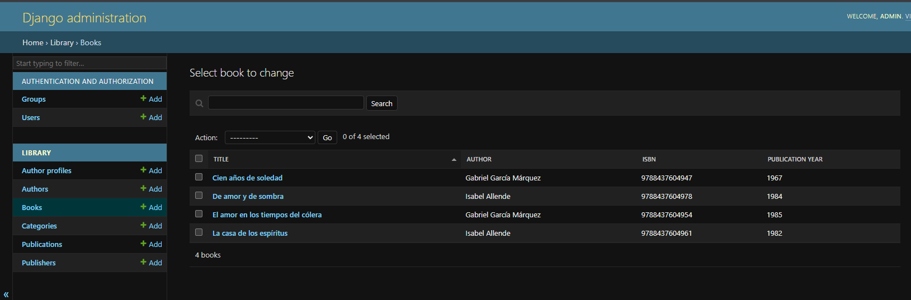
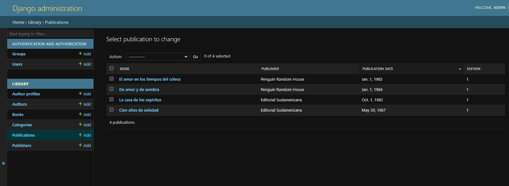
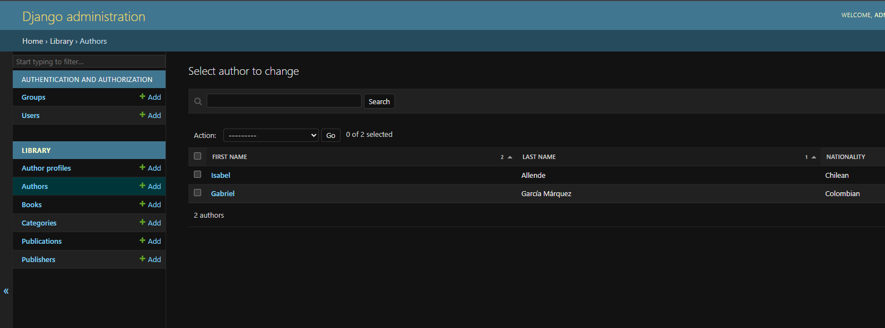
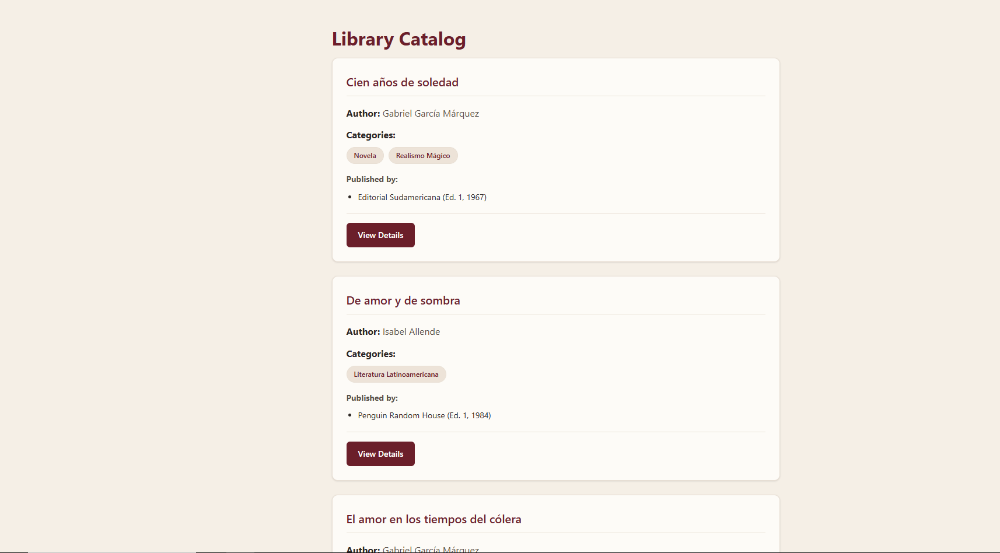
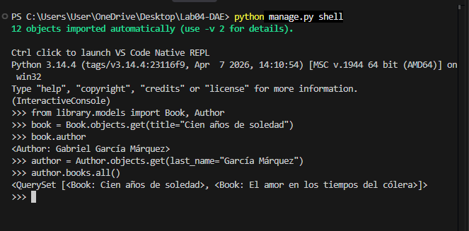

# Library Catalog — Relación de Modelos en Django

Proyecto de laboratorio de la semana 4 del curso **Desarrollo de Aplicaciones
Empresariales**. Implementa un catálogo de libros en Django que demuestra el
manejo completo de relaciones entre modelos: uno a uno, uno a muchos y
muchos a muchos (simple y con datos adicionales mediante un modelo
intermedio).

## Descripción

La aplicación permite explorar un catálogo de libros donde cada libro está
relacionado con su autor, sus categorías y las editoriales que lo han
publicado. El proyecto cubre desde la definición de los modelos y sus
relaciones hasta una interfaz web navegable (listado y detalle) que
demuestra que esas relaciones llegan correctamente hasta la vista.

## Estructura del proyecto

```
Lab04-DAE/
├── config/              # Configuración del proyecto (settings, urls raíz)
├── library/             # App principal: modelos, vistas, admin, templates
│   ├── models.py        # Author, AuthorProfile, Publisher, Category, Book, Publication
│   ├── views.py         # BookListView, BookDetailView
│   ├── urls.py          # Rutas de la app (listado y detalle)
│   ├── admin.py         # Registro de modelos en el panel de administración
│   ├── migrations/      # Historial de migraciones de la base de datos
│   ├── templates/       # book_list.html, book_detail.html, base.html
│   └── static/          # style.css (diseño visual del sitio)
├── docs/
│   ├── data-model-spec.md       # Especificación del esquema de datos
│   └── evidencia-consultas.md   # Consultas y prueba CASCADE vs PROTECT
├── .opencode/agents/    # Sub-agentes usados para desarrollar el proyecto
├── manage.py
└── db.sqlite3
```

## Modelo de datos

| Modelo | Relación | Descripción |
|---|---|---|
| `Author` | — | Autor del libro: nombre, fecha de nacimiento, nacionalidad. |
| `AuthorProfile` | `OneToOneField` → `Author` (CASCADE) | Datos biográficos separados del registro principal del autor. |
| `Publisher` | — | Editorial: nombre, país, año de fundación. |
| `Category` | — | Categoría o género literario. |
| `Book` | `ForeignKey` → `Author` (PROTECT)<br>`ManyToManyField` → `Category`<br>`ManyToManyField` → `Publisher` (a través de `Publication`) | Libro del catálogo, con ISBN, año de publicación, resumen y portada. |
| `Publication` | Modelo intermedio (`through`) entre `Book` y `Publisher` | Guarda la fecha de publicación y el número de edición de cada libro por editorial. |

El esquema completo, con todos los campos y justificaciones, está en
[`docs/data-model-spec.md`](docs/data-model-spec.md).

**[CAPTURA: panel de administración mostrando el listado de modelos `library` (Authors, Books, Publishers, Categories, Publications, Author profiles)]**

## Metodología de desarrollo (OpenCode)

Este proyecto se desarrolló usando [OpenCode](https://opencode.ai), un
agente de código con IA, apoyado en **sub-agentes especializados** creados
para este laboratorio. Cada sub-agente se encargó de una parte específica
del procedimiento, con instrucciones propias y acceso solo a las
herramientas que necesitaba:

| Sub-agente | Encargado de |
|---|---|
| `django-project-structure` | Crear el proyecto, instalar Pillow y registrar la app `library`. |
| `django-urls` | Configurar las rutas de archivos de medios. |
| `django-models` | Declarar los modelos y sus relaciones (FK, O2O, M2M, M2M con `through`). |
| `django-migrations` | Generar y aplicar migraciones, y verificar las tablas resultantes. |
| `django-admin` | Registrar los modelos en el admin y cargar los datos de prueba. |
| `django-queries` | Ejecutar y documentar las consultas del ORM y la prueba `CASCADE` vs `PROTECT`. |
| `django-templates` | Crear las vistas y plantillas (listado y detalle de libro). |
| `django-git` | Manejar los commits y la subida al repositorio. |
| `django-documentation` | Redactar la evidencia del laboratorio y este README. |

Los sub-agentes están definidos en [`.opencode/agents/`](.opencode/agents/)
y comparten como única fuente de verdad el esquema de datos descrito en
[`docs/data-model-spec.md`](docs/data-model-spec.md), para asegurar
consistencia entre los nombres de modelos, campos y relaciones a lo largo
de todo el desarrollo. Cada paso del procedimiento se registró en un
commit independiente, siguiendo el historial de Git del repositorio.

## Instalación y uso

```bash
# 1. Clonar el repositorio
git clone <url-del-repositorio>
cd Lab04-DAE

# 2. Crear y activar un entorno virtual (recomendado)
python -m venv venv
venv\Scripts\activate        # Windows
source venv/bin/activate     # Linux / macOS

# 3. Instalar dependencias
pip install -r requirements.txt

# 4. Aplicar migraciones
python manage.py migrate

# 5. Crear un superusuario para acceder al admin
python manage.py createsuperuser

# 6. Correr el servidor de desarrollo
python manage.py runserver
```

Luego abre:
- `http://127.0.0.1:8000/` — listado de libros
- `http://127.0.0.1:8000/books/<id>/` — detalle de un libro
- `http://127.0.0.1:8000/admin/` — panel de administración

## Capturas de funcionamiento

**[CAPTURA: panel de administración con los modelos registrados]**






**[CAPTURA: página de listado de libros ( / )]**


**[CAPTURA: página de detalle de un libro ( /books/1/ )]**


**[CAPTURA: resultado de una consulta de ida y vuelta en el shell de Django]**


